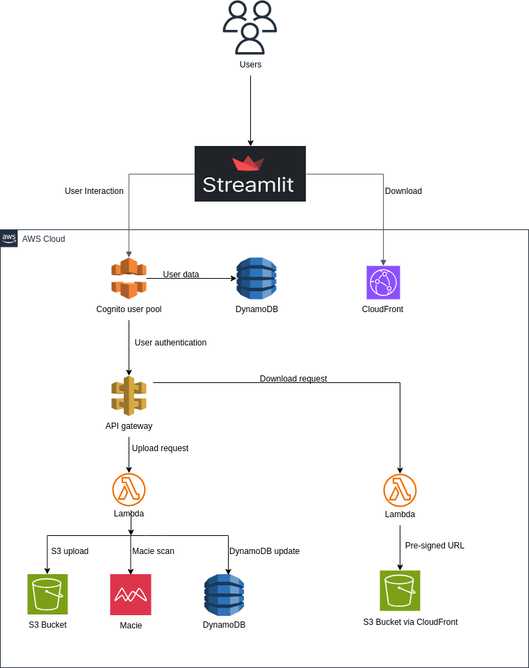

# File Sharing Application

A simple application that allows users share files from a common platform. Users can upload, download, view and delete files from the shared platform.

## The Architecture

The application follows this architecture:
<!-- markdownlint-disable MD033 -->

    
Click to expand

    

<!-- markdownlint-enable MD033 -->

### Flow of operations in the architecture
